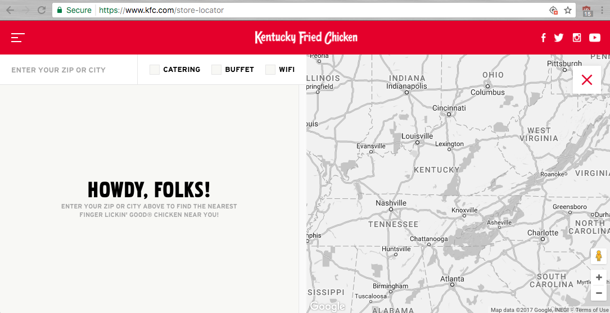
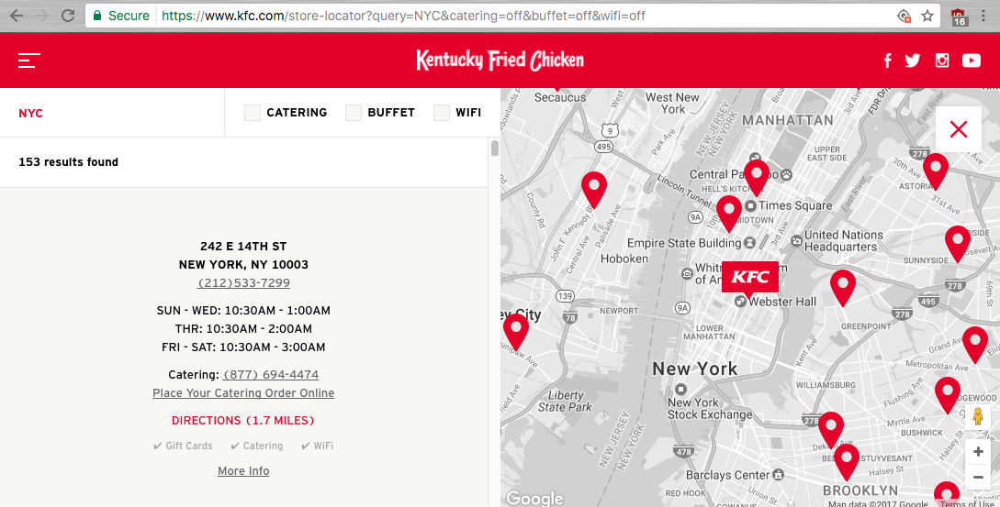
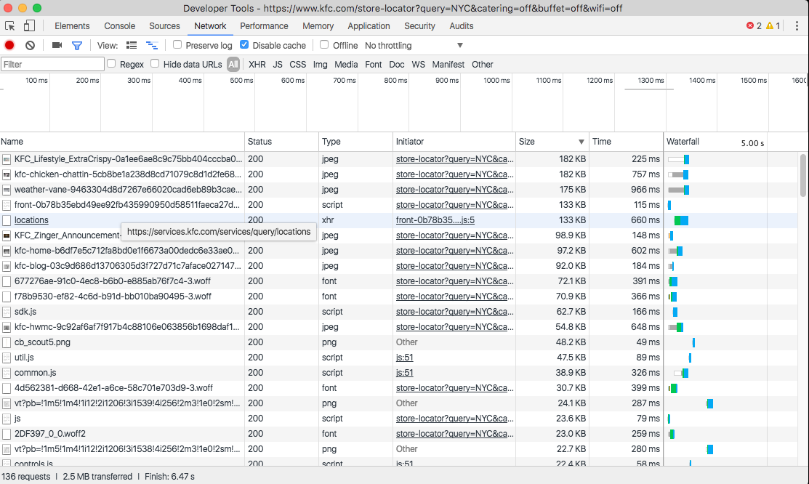
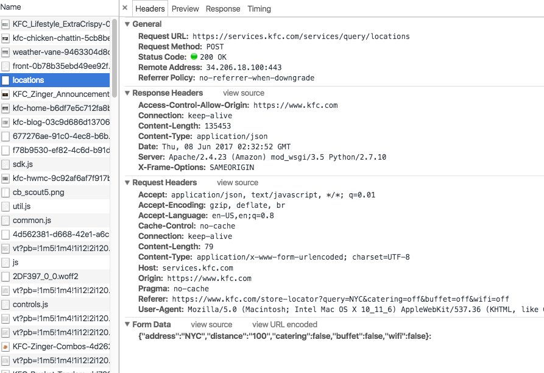

# kfc-scrape


# Manual walkthrough to find the data

KFC's store locator tool can be found here: 

https://www.kfc.com/store-locator

The user is prompted for their zip or city (and presumably *state*) location. There's also optional filters to find locations that feature catering, buffet, and/or wifi:





Typing in `NYC` as a sample search returns results like these:



And we can see that the URL includes serialized arguments, of which `query=NYC` is the key-value pair we care about:

https://www.kfc.com/store-locator?query=NYC&catering=off&buffet=off&wifi=off

## Using web inspector

Pop-open the Network Panel of your web inspector, refresh the search, and you'll see that a XHR request is made to the `locations`  endpoint (the full URL is `https://services.kfc.com/services/query/locations`):



Click the `locations` entry and view its **Headers**: looks like a standard **POST** request with the search parameters sent as form data:



Of particular note is the `distance` attribute in the form data, set to a default value of `100`.


## Making the request with Python's Requests

```py
import requests
BASE_ENDPOINT = 'https://services.kfc.com/services/query/locations'
search_params = { 'address': 'NYC', 'distance': '100', 
                  'catering': False, 'buffet': False, 'wifi': False }

resp = requests.post(BASE_ENDPOINT, data=search_params)
```

Calling the `.json()` method of the `resp` response object yields a Python dict that includes a list of 153 locations. You can see a cached version of that JSON at [assets/data/cached-nyc-kfc-locations.json](assets/data/cached-nyc-kfc-locations.json)


